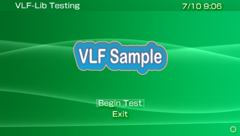
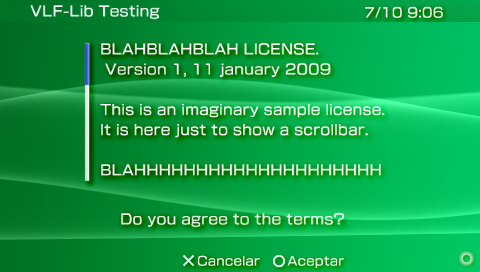

# VLF Interface test example

This application is an example for how the VLF library can create an UI that is XMB-like. The codebase was also updated to be compatible with CMake.

Based on the `loginscreen_bin` example from the [psp-vlf library backup](https://github.com/MichelMichels/psp-vlf).




## Building

You'll need [PSPDEV](https://pspdev.github.io/installation.html) installed on your system.

Head to the folder on a terminal, create a Build folder and do the following:

```bash
psp-cmake -DBUILD_PRX=ON ..
make
```

Once finished, it'll copy the finished files into the `/output` folder.

A VSCode build task is included on the repo if you want to automate the build process.

## Limitations

- On 6.61 (older versions may be affected too), checkmarks aren't compatible, so they will always return `NULL` by the library, and will crash your PSP if you attempt to interact with them *(I could take a look if I could find the source of the actual library, but I don't think it was ever released)*.
	- To mitigate it, I just went and checked if those were actually generated beforehand.

- The library is very picky about PNG images. The one used for the example is fine, but may very likely crash with whatever other image.

## Things I may do

- [ ] Make it use c++, so I can use classes.
- [ ] Create a class/namespace that can handle image resizing and placement in a easier manner.
- [ ] Make a Screen Manager of sorts that will take care of all objects in a particular screen, instead of having to manually clear each one.
- [ ] Make some consts so its easier to place stuff in known locations.
- [ ] Add support to hit the XMB Home button (Although since it's a system-like app, it wouldn't make sense?).
